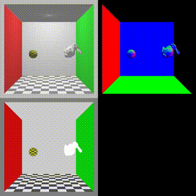

:warning: This repository is still under development, and parts of the project are subject to destructive changes.

Languages | English | [日本語](README_ja.md)

# PRayGround

PRayGround is a C++/CUDA library with OptiX 7 that provides you with an easy and scalable environment to have fun a interactive ray tracing on GPU. This includes wrapper libraries of OptiX 7 API, easy management system of device side data pointer in per-instance (shape, material, textures, bitmap...) basis, intuitive setup and looping functions, and easy build system via CMake that enables you to launch tons of rays by just modifying `App.h/cpp, main.cpp` and adding your ray tracing code.

This project still remain a huge room to improve its readability, performance, and scalability. I'd appreciate it if you advise me any things!


1920 x 1080, 100000spp, 592.9s on NVIDIA RTX 3090

# :computer: Requirements
Before building the project, please be sure to check requirements and your environment, especially if the your version of the C++ compiler supports C++20.

- CUDA Toolkit (Tested : 11.1, 11.2, 11.3, 11.4)
- C++ compiler which supports C++20 
    - Linux (Tested : g++ 10.3.0)
    - Windows (Tested : Visual Studio 2019, version 16.10.2) 
- OptiX 7 (Tested : 7.1, 7.2, 7.3, 7.4)
- CMake 3.0 minimum (Tested : cmake 3.16.3)

# :inbox_tray: Cloning
```
git clone https://github.com/sketchbooks99/PRayGround.git
cd PRayGround
git submodule update --init --recursive 
```

# :hammer: How to build
## Linux
Before a compilation, please be sure to export two environment variables `CC` and `CXX`. We recommend you to add them to your `~/.bashrc` file as follows so that they are automatically exported when a terminal is launched.
```
export CC=gcc-10
export CXX=g++-10
```
Next, you can build with following command. Please be sure to set `OptiX_INCLUDE` in terminal command of ccmake or in the launched prompt.
```
cd <path/to/PRayGround>
mkdir build
cd build

ccmake .. -DOptiX_INCLUDE=<path/to/OptiX>/include
or 
ccmake .. # and set OptiX_INCLUDE to the path of OptiX library include.
# You can generate a makefile with a standard step of CMake ( [C] Configure -> [G] Generate ).

make
```

After compiling got through, the execution file will be created in the `build/bin` directory. 
```
cd bin
./<app-name>
```

## Windows
On Windows, a recent version of **Visual Studio 2019** which supports C++20 features is required.

For configuring sources, please use [cmake-gui](https://cmake.org/download/) to generate the solution files.

Building steps are as follows.

1. Start up cmake-gui.

2. Set the `<path/to/PRayGround>` for the source code location ( **Where is the source code** ). 

3. Set the `<path/to/PRayGround>/build` for the binary location ( **Where to build the binaries** ).

4. Press `Configure` button at the bottom of the window. When a window popped up, be careful with the settings for the platform to build. You must select **Visual Studio 16 2019** as the generator to use the recent features of C++, and specify the **x64** for the generator platform because OptiX only supports 64-bit builds.

5. Press `Finish` button and configuration will start. If errors occur while configuring, it may be due to `OptiX_INCLUDE_NOTFOUND` error. If so, please set `OptiX_INCLUDE` to the path of Optix library include. On Windows, OptiX include directory may be located in `C:ProgramData\NVIDIA Corporation\OptiX SDK <your version>`.

6. When configulation finished, press `Generate`.

7. Open the `PRayGround.sln` solution file in the build directory.

8. Execute `Build Solution` in the IDE. When compilation is succeeded, the execution file will be created in the `build/bin/Debug or Release` directory. You also can run the ray tracer by setting the `<app-name>` project as start up project.

## Mac
Not supported.

# :bulb: Create new application
You can create your custom application by just adding new directory in `apps/` and modifying `App.h/.cpp`, `main.cpp` and `CMakeLists.txt`. 

The procedure is as follows:
1. Copy and paste `apps/empty_app` directory to `apps/` and rename the directory. 
2. Modifying the app-name in `CMakeLists.txt` inside the app directory. 
```
PRAYGROUND_add_executalbe(empty_app target_name # empty_app -> <your-app-name>
    main.cpp 
    app.cpp 
    app.h
)

target_compile_definitions(
    ${target_name}
    PRIVATE
    APP_DIR="${CMAKE_CURRENT_SOURCE_DIR}"
)

target_link_libraries(${target_name} ${CUDA_LIBRARIES})
```
3. Add line of `add_subdirectory(<your-app-name>)` in `PRayGround/CMakeLists.txt`.
```
# Executable apps
add_subdirectory(apps/empty_app)
add_subdirectory(apps/<your-app-name>) # Add this line
```
4. Enjoy coding!
5. Build your application using CMake.

# :art: Examples

| [Single GAS](examples/single_gas/) | [Path tracing](examples/pathtracing/) | [Obj scene](examples/objscene/) |
|-|-|-|
|  |  |  |
|[Ray Tracing: The Next Weekend](examples/rayTracingNextWeek/) | [Ray Tracing: The Rest Of Your Life](examples/rayTracingRestOfYourLife/) | [Dynamic update](examples/dynamic_update/) |
|  |  |  | 
| [Motion blur](examples/motion_blur/) | [Denoiser](examples/denoiser/) | [Spectrum](examples/spectrum/) | 
|  |  |  |
| [Volume](examples/pgVolume/) | | | 
|  | | |

# External libraries
- [glad](https://github.com/Dav1dde/glad) ... For OpenGL features
- [GLFW](https://github.com/glfw/glfw) ... For OpenGL
- [hapPLY](https://github.com/nmwsharp/happly) ... For loading PLY mesh
- [Dear ImGui](https://github.com/ocornut/imgui) ... For easy GUI usage
- [stb](https://github.com/nothings/stb) ... To read/write image of PNG, JPG format
- [tinyexr](https://github.com/syoyo/tinyexr/) ... To read/write(future work) image of OpenEXR format
- [tinyobjloader](https://github.com/tinyobjloader/tinyobjloader) ... For loading OBJ mesh
