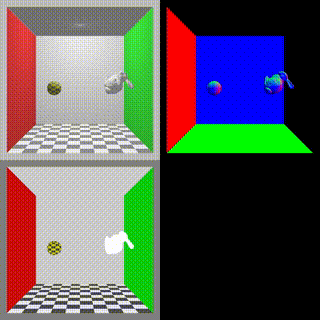

:warning: このリポジトリはまだ開発途中で、一部に破壊的な変更が加わる可能性があります。

Languages | [English](README.md) | 日本語

# PRayGround

PRayGroundは、OptiX 7を用いたC++/CUDAライブラリで、GPUによるインタラクティブなレイトレーシングを楽しむための、簡単でスケーラブルな環境を提供します。これには、OptiX 7 APIのラッパーライブラリ、シェイプやマテリアル等のインスタンスごとにデバイス側のポインタを簡単に管理できる仕組み、直感的なセットアップとループ関数、CMakeによるビルドシステムが含まれており、App.h/cpp、main.cppを修正して、レイトレーシングコードを追加するだけで、GPUレイトレーシングを起動できます。

このプロジェクトには、読みやすさ、パフォーマンス、スケーラビリティを向上させるためにまだまだやることがたくさん残っています。何かアドバイスを頂ければ幸いです。


# :computer: Requirements
プロジェクトをビルドする前に、以下の要件、特にC++のコンパイラが `<concepts>` ヘッダー等のC++20の機能をサポートしているかどうか確認してください。

- CUDA Toolkit (Tested : 11.1, 11.2)
- C++ compiler which supports C++20 
    - Linux (Tested : g++ 10.3.0)
    - Windows (Tested : Visual Studio 2019, version 16.10.2) 
- OptiX 7 (Tested : 7.1, 7.2, 7.3)
- CMake 3.0 minimum (Tested : cmake 3.16.3)

# :inbox_tray: Cloning
```
git clone https://github.com/uec-media-design-lab/PRayGround.git
cd PRayGround
git submodule update --init --recursive 
```

# :hammer: How to build
## Linux
コンパイルする前に，環境変数 `CC` と `CXX` をエクスポートしてください。これらの環境変数は、ターミナルを起動したときに自動的にエクスポートされるように、`~/.bashrc` ファイルへの記述を推奨します。
```
export CC=gcc-10
export CXX=g++-10
```
次に、以下のコマンドでビルドします。ターミナルで`ccmake`を実行するときもしくはccmakeのプロンプトで必ず`OptiX_INCLUDE`を設定してください。
```
cd <path/to/PRayGround>
mkdir build
cd build

ccmake .. -DOptiX_INCLUDE=<path/to/OptiX>/include
or 
ccmake .. # and set OptiX_INCLUDE to the path of OptiX library include.
# You can generate a makefile with a standard step of CMake ( [C] Configure -> [G] Generate ).

make
```

コンパイルが完了すると、`build/bin`ディレクトリに実行ファイルが生成されます。
```
cd bin
./<app-name>
```

## Windows
Windowsでは、C++20の機能をサポートしている**Visual Studio 2019**の最新版が必要です。

CMakeの実行では、[cmake-gui](https://cmake.org/download/)を使用してください。

ビルドの手順は以下のとおりです。

1. cmake-gui を起動します。

2. ソースコードの場所（**Where is the source code**）には、`<path/to/PRayGround>` を設定してください。

3. バイナリの場所（**Where to build the binaries**）には、`<path/to/PRayGround>/build` を設定してください。

4. ウィンドウの下部にある `Configure` ボタンを押してください。ポップアップウィンドウが表示されたら、注意してビルドするプラットフォームの設定を選択してください。最近のC++の機能を使うためには、ジェネレーターとして **Visual Studio 16 2019** を選択し、OptiXは64-bitのビルドしかサポートしていないため、ジェネレーターのプラットフォームには **x64** を指定してください。

5. `Finish` ボタンを押すとビルド情報の収集が始まります。処理中にエラーが発生する場合は、`OptiX_INCLUDE_NOTFOUND` に起因するエラーの可能性があります。その場合は、`OptiX_INCLUDE` にOptiXのインクルードディレクトリのパスを設定してください。Windowsの場合、OptiXのインクルードディレクトリは、`C:ProgramData\NVIDIA Corporation\OptiX SDK <your version>` にあります。

6. 処理が完了したら, `Generate` ボタンを押してください。

7. `build/` ディレクトリにある `PRayGround.sln` というソリューションファイルを開いてください。

8. IDEで `ソリューションのビルド` を実行します。コンパイルが成功すると、実行ファイルが `build/bin/Debug or Release` に作成されます。また、`<app-name>` プロジェクトをスタートアッププロジェクトとして設定し、`ローカル Windows デバッガー` を実行することで、レイトレーサーを簡単に実行できます。

## Mac
サポートしていません。

# :bulb: Create new application
`apps/` に新しいディレクトリを追加して、`App.h/.cpp`、`main.cpp`、`CMakeLists.txt`を修正するだけで、アプリケーションの作成が可能です。

アプリケーション作成は次の手順に沿ってください
1. `apps/empty_app `ディレクトリを `apps/` にコピー＆ペーストして、ディレクトリ名を変更します。
2. 作成したディレクトリ内の`CMakeLists.txt`の `empty_app` を作成するアプリケーション名に変更します。
```
PRAYGROUND_add_executalbe(empty_app target_name # empty_app -> <your-app-name>
    main.cpp 
    app.cpp 
    app.h
)

target_compile_definitions(
    ${target_name}
    PRIVATE
    APP_DIR="${CMAKE_CURRENT_SOURCE_DIR}"
)

target_link_libraries(${target_name} ${CUDA_LIBRARIES})
```
3. `PRayGround/CMakeLists.txt` に、`add_subdirectory(<your-app-name>)`の行を追加します。
```
# Executable apps
add_subdirectory(apps/empty_app)
add_subdirectory(apps/<your-app-name>) # Add this line
```
4. レイトレーシングコードを記述し、CMakeを使ってビルドしてください。

# :art: Examples
- [Single GAS](examples/single_gas/)
  - 
- [Path tracing](examples/pathtracing/)
  -  
  -  
- [Obj scene](examples/objscene/)
  - 
- [Ray Tracing: The Next Weekend](examples/rayTracingNextWeek/)
  - 
- [Ray Tracing: The Rest Of Your Life](examples/rayTracingRestOfYourLife/)
  -  
- [Dynamic update](examples/dynamic_update/)
  - 
- [Motion blur](examples/motion_blur/)
  - 

# External libraries
- [glad](https://github.com/Dav1dde/glad) ... For OpenGL 
- [GLFW](https://github.com/glfw/glfw) ... For OpenGL
- [hapPLY](https://github.com/nmwsharp/happly) ... For loading PLY mesh
- [Dear ImGui](https://github.com/ocornut/imgui) ... For easy GUI usage
- [stb](https://github.com/nothings/stb) ... To read/write image of PNG, JPG format
- [tinyexr](https://github.com/syoyo/tinyexr/) ... To read/write(future work) image of OpenEXR format
- [tinyobjloader](https://github.com/tinyobjloader/tinyobjloader) ... For loading OBJ mesh
